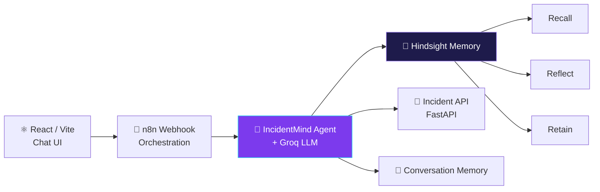
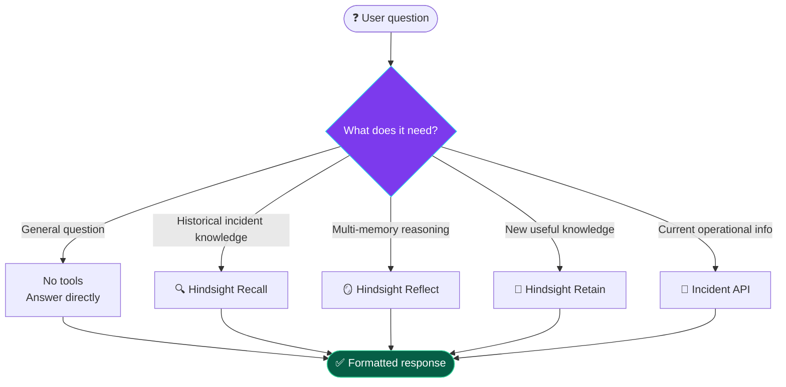
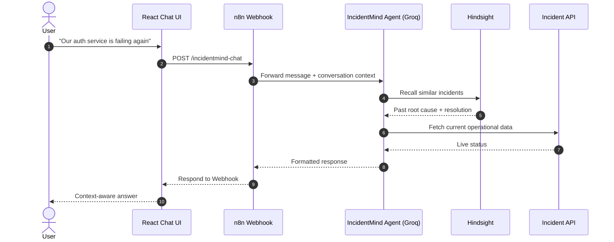

<div align="center">


<a href="https://git.io/typing-svg">
  
</a>

<br/>


<br/>

**IncidentMind** is a **memory-first AI Incident Response Agent** for DevOps/SRE teams.
It combines LLM reasoning with persistent organizational memory, so every new incident starts with the knowledge of every past one.

[Features](#-what-incidentmind-does) •
[Architecture](#-memory-first-architecture) •
[Hindsight](#-how-hindsight-is-used) •
[Tech Stack](#%EF%B8%8F-technology-stack) •
[Getting Started](#-getting-started) •
[Structure](#-project-structure)

</div>

---

## 🚀 What IncidentMind Does

<table>
<tr>
<td width="50%">

🔎 **Analyze incidents**
Answer general technical and incident-related questions.

📚 **Recall history**
Retrieve relevant historical incident knowledge.

🛠️ **Reuse resolutions**
Bring back previous resolutions, root causes, and lessons learned.

</td>
<td width="50%">

🧩 **Reason across memories**
Synthesize insight from many past incidents at once.

📡 **Use live data**
Pull current operational data when available.

💾 **Retain knowledge**
Store useful findings for future investigations.

</td>
</tr>
<tr>
<td colspan="2" align="center">

💬 **Short-term conversation context** + 🧠 **Long-term organizational memory** = separate chats, never lost knowledge

</td>
</tr>
</table>

---

## 🧠 Memory-First Architecture

<div align="center">
  
</div>

<details>
<summary><b>📊 View as Mermaid diagram</b></summary>



</details>

---

## 🧠 How Hindsight Is Used

Hindsight is the **long-term organizational memory** of IncidentMind. The workflow uses a persistent Hindsight bank named `incidentmind`, and the Recall, Reflect and Retain tools are all connected to it.

| Tool | Purpose | Example |
|:---:|---|---|
| 🔍 **Recall** | Search previous incidents when a question depends on history | *"Have we seen this authentication failure before?"* |
| 🪞 **Reflect** | Synthesize information across multiple memories | *"What lessons should we apply from our previous incidents?"* |
| 💾 **Retain** | Store useful incident knowledge for the future | Root causes, resolutions, failed attempts, postmortems |

<details>
<summary><b>💾 What gets retained?</b></summary>

- Root causes
- Successful resolutions
- Failed troubleshooting attempts
- Deployment lessons
- Postmortem findings
- Repeated failure patterns

</details>

---

## 🤖 AI Reasoning

The agent, powered by **Groq**, decides which tool (if any) a question needs, so unrelated questions are never forced through incident memory.



---

## 🔄 Request Flow



---

## 💡 Before vs. After Memory

<table>
<tr>
<th width="50%">😐 Normal AI assistant</th>
<th width="50%">🧠 IncidentMind</th>
</tr>
<tr>
<td>

> *"Our authentication service is failing again. What should we check?"*

Generic troubleshooting steps that ignore your history.

</td>
<td>

> *"Our authentication service is failing again. What should we check?"*

```
Current question
   ↓ Recall previous incidents
   ↓ Find similar auth failure
   ↓ Retrieve previous resolution
   ↓ Combine history + current context
   ↓ Relevant, experience-backed answer
```

</td>
</tr>
</table>

> **The goal is not just to answer questions, but to learn from organizational experience.**

---

## 🛠️ Technology Stack

| Layer | Technology |
|---|---|
| 🎨 Frontend | React + Vite |
| ⚙️ Backend | FastAPI / Python |
| 🤖 AI Model | Groq |
| 🔗 AI Orchestration | n8n |
| 🧠 Long-Term Memory | Hindsight |
| 💬 Short-Term Memory | Conversation Memory |
| 🗄️ Database | PostgreSQL |
| 🌐 API Communication | REST / Webhooks |
| 🔧 Version Control | Git + GitHub |

---

## ⚡ Getting Started

<details open>
<summary><b>1️⃣ Clone the repository</b></summary>

```bash
git clone https://github.com/YOUR_USERNAME/IncidentMind.git
cd IncidentMind
```

</details>

<details>
<summary><b>2️⃣ Start the backend (FastAPI)</b></summary>

```bash
cd backend
pip install -r requirements.txt
uvicorn main:app --reload
```

</details>

<details>
<summary><b>3️⃣ Import the n8n workflow</b></summary>

1. Open n8n and import `n8n/incidentmind-workflow.json`.
2. Add your credentials (Groq, Hindsight, etc.) in n8n's credential manager.
3. Confirm the webhook is a **POST** on the path `incidentmind-chat` and activate the workflow.

</details>

<details>
<summary><b>4️⃣ Start the frontend (React + Vite)</b></summary>

```bash
cd frontend
cp .env.example .env      # then set your webhook URL
npm install
npm run dev
```

```env
VITE_N8N_CHAT_URL=https://your-n8n-host/webhook/incidentmind-chat
```

</details>

---

## 🔐 Security

- API keys and credentials stay **outside** the React application.
- `VITE_N8N_CHAT_URL` is configuration only; sensitive credentials live in the backend / n8n credential systems.
- **Never commit `.env` files or API keys to GitHub.**

---

## 📁 Project Structure

```text
IncidentMind/
│
├── frontend/
│   ├── src/
│   ├── package.json
│   └── .env.example
│
├── backend/
│   ├── main.py
│   └── requirements.txt
│
├── n8n/
│   └── incidentmind-workflow.json
│
├── assets/
│   └── architecture.svg
│
├── .gitignore
└── README.md
```

---

## 🎯 Hackathon MVP

- [x] AI-powered incident-response conversation
- [x] Groq-based reasoning
- [x] n8n workflow orchestration
- [x] Hindsight persistent organizational memory
- [x] Recall of historical knowledge
- [x] Reflection across memories
- [x] Retention of useful incident knowledge
- [x] React-based chat interface
- [x] Separate conversations with persistent long-term memory

### 💭 Core idea

> ### **New Chat doesn't mean Forget.**
> IncidentMind separates *conversation context* from *organizational memory*, so the agent can start a fresh conversation while still remembering what previous incidents taught it.

---

<div align="center">

### 🏆 In one line

**IncidentMind is a memory-first AI Incident Response Agent that combines Groq-powered reasoning, n8n orchestration, and Hindsight persistent organizational memory to help teams learn from past incidents and improve future investigations.**

<br/>

⭐ **If you like this project, give it a star!** ⭐


</div>
